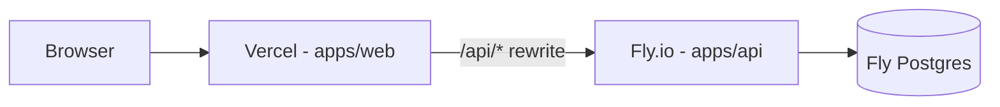

# Trakr

[](https://github.com/mmmbacon/trakr/actions/workflows/ci.yml)

Trakr is a solo issue tracker with agent coordination (pivot in progress). Monorepo: React frontend, Rails API, Vercel + Fly.io deploy.

**Live app:** [trakr-lemon.vercel.app](https://trakr-lemon.vercel.app/login)

## Architecture



In production, the Vite app is served from Vercel. Browser requests to `/api/*` are rewritten to the Rails API on Fly.io, so the frontend stays same-origin. Locally, Vite proxies `/api` to Rails on port 3000.

## Apps

- `apps/web` — React 18, Vite 6, TypeScript, MUI 6, Redux Toolkit
- `apps/api` — Ruby on Rails 7.2 API, served by Fly.io in production
- `docker-compose.yml` — Local PostgreSQL for development

## Prerequisites

- Node.js **22** (see `apps/web/.nvmrc`)
- npm
- Ruby **3.3.11**
- Bundler
- Docker Desktop
- Fly CLI (production API deploys)

No OpenSSL legacy provider or CRA workarounds are required.

## Local Setup

Install frontend dependencies:

```sh
cd apps/web
npm install
```

Install backend dependencies:

```sh
cd apps/api
bundle install
```

Start PostgreSQL and load the schema/demo data:

```sh
npm run db:setup
```

Run both apps from the repository root:

```sh
npm run dev
```

The frontend opens at http://localhost:8080. Vite proxies `/api` requests to the Rails API at http://localhost:3000 (see `apps/web/vite.config.ts`). Root npm scripts use `scripts/with-ruby.sh` to prefer Homebrew `ruby@3.3` when available (Apple Silicon or Intel), or your existing PATH via rbenv/asdf. Override with `TRAKR_RUBY_BIN=/path/to/ruby/bin` if needed.

`Procfile.dev` is available if you prefer Foreman or Overmind; `npm run dev` uses `concurrently` by default.

## Useful Commands

```sh
npm run dev            # Start React and Rails together
npm run dev:web        # Start only the React app
npm run dev:api        # Start only the Rails API
npm run db:up          # Start local PostgreSQL
npm run db:setup       # Start DB, load schema, and seed demo data
npm run lint:web       # ESLint in apps/web
npm run typecheck:web  # TypeScript check in apps/web
npm run test:web       # Vitest in apps/web
npm run test:api       # Rails test suite (requires Postgres)
npm run build:web      # Production build of the React app
```

## CI

GitHub Actions runs on every push and pull request to `main` / `master`:

| Job | What it runs |
|-----|----------------|
| **API tests** | Rails test suite against Postgres 14 |
| **Web CI** | `npm ci` → lint → typecheck → test → build in `apps/web` |

Run the web checks locally:

```sh
npm run lint:web
npm run typecheck:web
npm run test:web
npm run build:web
```

Run API tests locally (Docker Postgres on port **55432**; CI uses **5432**):

```sh
npm run db:up
npm run test:api:prepare
npm run test:api
```

## Environment Variables

Use `.env.example` as the source of truth.

### Frontend (`apps/web/.env.local` or Vercel)

| Variable | Purpose |
|----------|---------|
| `VITE_DEMO_MODE` | `true` enables demo mode (auto-login with sample data) |
| `VITE_GOOGLE_API_KEY` | Google Places API key for location autocomplete |

### Backend (local shell overrides)

| Variable | Default (Docker) |
|----------|------------------|
| `DB_HOST` | `127.0.0.1` |
| `DB_USERNAME` | `postgres` |
| `DB_PASSWORD` | `postgres` |
| `DB_PORT` | `55432` |
| `DEMO_MODE` | `true` |
| `DEMO_USER_EMAIL` | `beetman@shrutefarms.com` |

### Backend (Fly.io secrets)

| Variable | Purpose |
|----------|---------|
| `DATABASE_URL` | Created by `fly postgres attach` |
| `RAILS_MASTER_KEY` | Rails credentials key |
| `SECRET_KEY_BASE` | Session signing secret |
| `DEMO_MODE` | `true` for portfolio demo |
| `DEMO_USER_EMAIL` | Demo user email |

## Production Deploy

### Checklist

**Frontend (Vercel)**

1. Create project with Root Directory `apps/web`
2. Framework: Vite; Build Command: `npm run build`; Output Directory: `dist`
3. Set `VITE_DEMO_MODE` and `VITE_GOOGLE_API_KEY`
4. Deploy — `apps/web/vercel.json` rewrites `/api/*` to Fly

**API (Fly.io)**

1. From `apps/api`: `fly deploy`
2. Ensure Postgres is attached and secrets are set
3. Run `fly ssh console -C "bin/rails db:seed"` if seed data is needed
4. Confirm health check hits `/api/logged_in`

**Smoke test**

1. Open the Vercel URL — demo banner should appear when `VITE_DEMO_MODE=true`
2. Dashboard loads sample projects and issues
3. API calls succeed via same-origin `/api` proxy

### API: Fly.io + Fly Postgres

From `apps/api`:

```sh
fly launch --no-deploy
fly postgres create --name trakr-db
fly postgres attach trakr-db
fly secrets set RAILS_MASTER_KEY=... SECRET_KEY_BASE=... DEMO_MODE=true DEMO_USER_EMAIL=beetman@shrutefarms.com
fly deploy
fly ssh console -C "bin/rails db:seed"
```

The included `apps/api/fly.toml` assumes an app named `trakr-api` in the `sea` region. If `fly launch` creates a different app name, update `apps/api/fly.toml` and the Vercel rewrite destination in `apps/web/vercel.json`.

### Frontend: Vercel

Create a Vercel project from this repository with:

- Root Directory: `apps/web`
- Build Command: `npm run build`
- Output Directory: `dist`
- Framework: Vite

Set Vercel environment variables for the frontend, then deploy. Vercel rewrites `/api/*` to the Fly API via `apps/web/vercel.json`, so browser requests stay same-origin.
