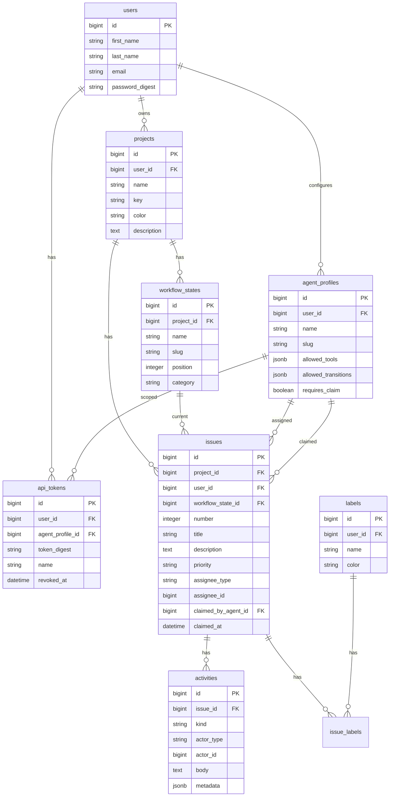

# Data Model

> **Status:** Draft  
> **Phase:** 0 → implements in Phase 1  
> **Related:** [migration-from-jobs.md](./migration-from-jobs.md), [phase-1-domain-pivot.md](./phase-1-domain-pivot.md)

## Decisions (Phase 0)

| Question | Decision |
|----------|----------|
| Issue numbers | Per-project sequential integer; display as `{project.key}-{number}` |
| Workflow states | Per-project; copied from template on project create |
| Comments | `activities` with `kind: comment` (no separate table) |
| Assignee (Phase 3) | `assignee_type` + `assignee_id` polymorphic |
| Priority | Enum string: `none`, `low`, `medium`, `high`, `urgent` |

---

## ERD



---

## Tables

### `projects`

| Column | Type | Notes |
|--------|------|-------|
| `user_id` | FK | Owner |
| `name` | string | Display name |
| `key` | string | Short uppercase key, unique per user (`TRK`) |
| `color` | string | Hex or token key |
| `description` | text | Optional |

**Indexes:** `[user_id, key]` unique

### `workflow_states`

| Column | Type | Notes |
|--------|------|-------|
| `project_id` | FK | |
| `name` | string | e.g. "In Progress" |
| `slug` | string | e.g. `in_progress` |
| `position` | integer | Column order on board |
| `category` | string | `backlog`, `active`, `done` — for queue queries |

**Default template (seed):**

| position | name | slug | category |
|----------|------|------|----------|
| 0 | Backlog | backlog | backlog |
| 1 | Triage | triage | backlog |
| 2 | Ready | ready | active |
| 3 | In Progress | in_progress | active |
| 4 | Done | done | done |

### `issues`

| Column | Type | Notes |
|--------|------|-------|
| `project_id` | FK | |
| `user_id` | FK | Owner |
| `number` | integer | Scoped unique per project |
| `title` | string | Required |
| `description` | text | Markdown |
| `workflow_state_id` | FK | |
| `priority` | string | Default `none` |
| `assignee_type` | string | null, `human`, `agent` |
| `assignee_id` | bigint | user id or agent_profile id |
| `claimed_by_agent_id` | FK | Phase 3 |
| `claimed_at` | datetime | Phase 3 |

**Indexes:** `[project_id, number]` unique, `[workflow_state_id]`, `[user_id]`

### `activities`

| Column | Type | Notes |
|--------|------|-------|
| `issue_id` | FK | |
| `kind` | string | See kinds below |
| `actor_type` | string | `human`, `agent`, `system` |
| `actor_id` | bigint | Nullable for system |
| `body` | text | Comment text or summary |
| `metadata` | jsonb | Kind-specific payload |

**Kinds:** `comment`, `status_change`, `claim`, `release`, `agent_run`, `pr_linked`, `created`

**metadata examples:**

```json
// status_change
{ "from_state_id": 2, "to_state_id": 3, "from_slug": "ready", "to_slug": "in_progress" }

// pr_linked
{ "url": "https://github.com/...", "title": "Fix scroll" }
```

### `labels` / `issue_labels`

Standard many-to-many. Labels scoped to `user_id` in v1.

### `agent_profiles` (Phase 3)

See [phase-3-agent-coordination.md](./phase-3-agent-coordination.md).

### `api_tokens` (Phase 4)

See [phase-4-mcp-v1.md](./phase-4-mcp-v1.md).

---

## API resources

### Issue (JSON)

```json
{
  "id": 1,
  "number": 42,
  "identifier": "TRK-42",
  "title": "Issue panel routing",
  "description": "## Acceptance\n\n- [ ] Deep link works",
  "priority": "high",
  "project": {
    "id": 1,
    "key": "TRK",
    "name": "Trakr",
    "color": "#5E6AD2"
  },
  "workflow_state": {
    "id": 4,
    "name": "In Progress",
    "slug": "in_progress",
    "position": 3,
    "category": "active"
  },
  "assignee": {
    "type": "agent",
    "id": 2,
    "name": "Implementer",
    "slug": "implementer"
  },
  "claimed_by": {
    "id": 2,
    "name": "Implementer",
    "claimed_at": "2026-05-22T10:00:00Z"
  },
  "labels": [{ "id": 1, "name": "ui", "color": "#888" }],
  "created_at": "2026-05-20T08:00:00Z",
  "updated_at": "2026-05-22T10:00:00Z"
}
```

### Activity (JSON)

```json
{
  "id": 10,
  "kind": "comment",
  "body": "Claimed for implementation.",
  "actor": { "type": "agent", "id": 2, "name": "Implementer" },
  "metadata": {},
  "created_at": "2026-05-22T10:00:00Z"
}
```

---

## TypeScript types (sketch)

```typescript
export interface Project {
  id: number;
  key: string;
  name: string;
  color: string;
  description?: string;
}

export interface WorkflowState {
  id: number;
  name: string;
  slug: string;
  position: number;
  category: 'backlog' | 'active' | 'done';
}

export interface Issue {
  id: number;
  number: number;
  identifier: string;
  title: string;
  description: string;
  priority: 'none' | 'low' | 'medium' | 'high' | 'urgent';
  project: Project;
  workflow_state: WorkflowState;
  assignee?: Assignee;
  claimed_by?: { id: number; name: string; claimed_at: string };
  labels: Label[];
  created_at: string;
  updated_at: string;
}

export type Assignee =
  | { type: 'human'; id: number; name: string }
  | { type: 'agent'; id: number; name: string; slug: string };
```

Location: `apps/web/src/types/index.ts` (replace `Job` types).

---

## Issue number generation

Use DB counter per project:

```ruby
# In Issue model before_create
self.number = (project.issues.maximum(:number) || 0) + 1
```

Or `projects.next_issue_number` with row lock for concurrency.

Display: `"#{project.key}-#{number}"` — no global sequence.

---

## Seed data sketch

- **User:** demo user (existing)
- **Projects:** `TRK` (Trakr), `BMP` (Portfolio)
- **Issues:** 8–12 across states, mixed priorities
- **Activities:** 2–3 per active issue; include one agent-attributed comment (Phase 3)
- **Labels:** `ui`, `api`, `mcp`, `docs`, `bug`
- **Agent profiles:** Triage, Implementer, Scribe (Phase 3)
